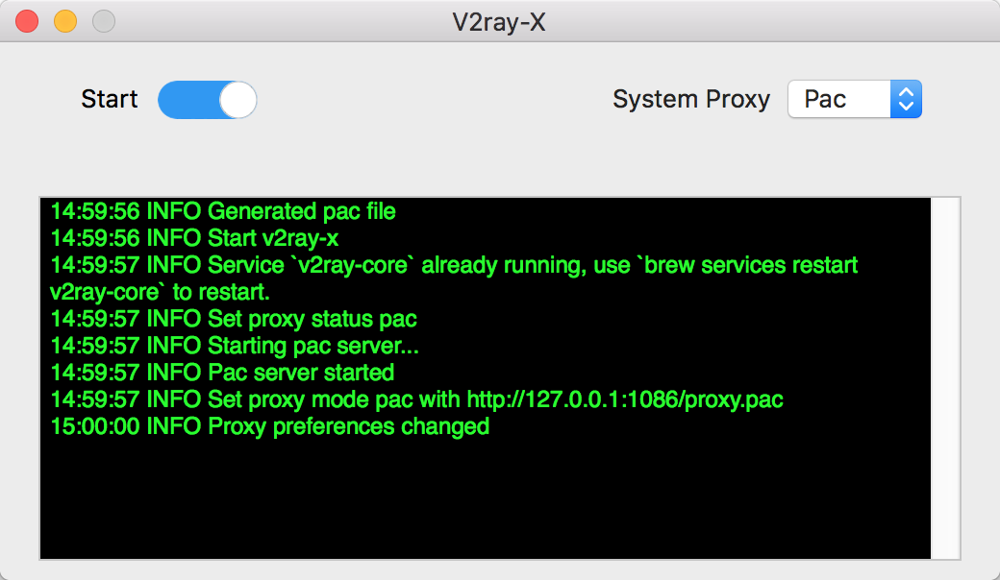

# V2ray-X


V2ray-X is a simple v2ray service manager for Mac OS

-------



## What V2ray-X can do

V2ray-X can 

1. Start/Stop v2ray service installed by brew
2. Setup system proxy setting to none/pac/global

## Before use

Install v2ray-core via brew

```bash
brew install v2ray-core
```

Edit your v2ray config in `/usr/local/etc/config.json`